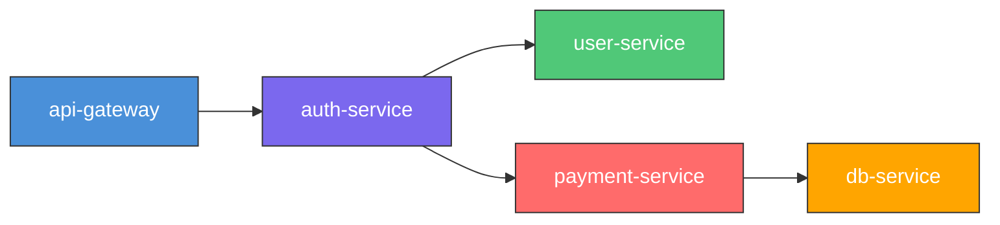

# 🚨 sre-automation-env

> An [OpenEnv](https://huggingface.co/spaces/open-env/leaderboard)-compatible reinforcement learning environment that simulates the daily work of a Site Reliability Engineer. Agents must triage noisy alert queues, diagnose cascading production incidents across a microservice graph, execute operational runbooks with stateful parameter dependencies, and handle advanced SRE scenarios.

---

## 1. Environment Description & Motivation

Site Reliability Engineering is a **\$30B+ market** where every minute of downtime costs real revenue. Alert fatigue is the #1 cause of missed incidents — human SREs are bombarded with hundreds of alerts per shift, most of which are noise. The operational decisions they make — which alerts to ignore, where to look first, what remediation steps to take — are exactly the kind of sequential, high-stakes reasoning that RL agents should learn.

`sre-automation-env` captures this operational reality across **9 tasks** organized into 3 difficulty tiers:

### 🟢 Easy — Foundational SRE Skills

- **Alert Triage** mirrors the PagerDuty/OpsGenie workflow: sort through noisy, flapping, duplicate alerts and acknowledge the critical ones first.
- **On-Call Handoff** tests shift rotation communication: summarize active incidents, pending actions, and service health for the incoming engineer.
- **Capacity Planning** analyzes metrics trends and recommends scaling decisions based on utilization, growth rate, and upcoming events.

### 🟡 Medium — Diagnostic & Remediation Skills

- **Incident Diagnosis** simulates the real-time investigation an on-call SRE does during a production outage — querying metrics, reading logs, tracing cascading failures through a dependency graph.
- **Multi-Incident Correlation** determines whether multiple simultaneous alerts share a common root cause or are independent incidents requiring separate handling.
- **Auto-Remediation with Rollback** executes a fix, verifies if it improved the situation, and rolls back if it made things worse — testing judgment under uncertainty.

### 🔴 Hard — Complex Operational Reasoning

- **Runbook Execution** tests procedural reasoning: can the agent follow a multi-step operational playbook where each step's output feeds into the next?
- **Blameless Postmortem Generation** synthesizes incident timeline, root cause analysis, and actionable follow-ups into a professional postmortem document.
- **Chaos Engineering Scenario** injects a controlled failure, observes system impact, and executes mitigation steps in the correct order to restore stability.

### Service Topology

The environment uses a realistic microservice dependency graph where failures cascade through the chain:



When `db-service` has high latency, it cascades up through `payment-service` → `auth-service` → `api-gateway`. This mirrors real production architectures where identifying the *root cause* vs. a *symptom* is the core diagnostic challenge.

---

## 2. Task Matrix

| Task | Difficulty | Max Steps | Target Score (GPT-4o) | Success Criteria |
|---|---|---|---|---|
| **Alert Triage** | 🟢 Easy | 10 | ~0.7 | Ignore flapping/duplicate alerts, acknowledge actionable alerts in P1→P2→P3 order |
| **On-Call Handoff** | 🟢 Easy | 6 | ~0.6 | Summarize active incidents, pending actions, severity levels, and service health |
| **Capacity Planning** | 🟢 Easy | 5 | ~0.6 | Query data, recommend correct scaling action with accurate replica count |
| **Incident Diagnosis** | 🟡 Medium | 12 | ~0.5 | Query selective metrics/logs, identify root cause service + failure mode |
| **Multi-Incident Correlation** | 🟡 Medium | 10 | ~0.5 | Correctly classify alerts as shared/independent/partial correlation |
| **Auto-Remediation** | 🟡 Medium | 8 | ~0.5 | Choose correct fix, verify recovery, rollback if needed |
| **Runbook Execution** | 🔴 Hard | 15 | ~0.3 | Execute all 7 runbook steps in order with correct parameters (including extracted pid) |
| **Blameless Postmortem** | 🔴 Hard | 8 | ~0.4 | Write all 5 sections with substantive content matching incident data |
| **Chaos Engineering** | 🔴 Hard | 12 | ~0.4 | Inject failure, observe impact, mitigate in correct order |

---

## 3. Action Space

| `action_type` | `target` | `parameters` | Used In |
|---|---|---|---|
| `triage` | Alert ID | `{"decision": "ignore\|actionable", "priority": "P1\|P2\|P3"}` | Alert Triage |
| `acknowledge` | Alert ID | Optional `{"priority": "P1"}` | Alert Triage |
| `diagnose` | Service name | `{"operation": "query_metrics\|query_logs\|submit_diagnosis", "failure_mode": "..."}` | Incident Diagnosis, Multi-Incident, Postmortem |
| `execute_step` | Runbook step name | Step-specific params: `service`, `pid`, `instance_id`, `replicas`, `wait_seconds`, `summary` | Runbook Execution |
| `escalate` | Any target | Optional escalation metadata | All tasks |
| `resolve` | Task target | Confirmation / no-op | All tasks |
| `summarize` | `"handoff"` | `{"summary": "<text>"}` | On-Call Handoff |
| `query_capacity` | Service name | `{}` | Capacity Planning |
| `recommend_scaling` | Service name | `{"recommendation": "...", "target_replicas": <int>}` | Capacity Planning |
| `correlate` | `"all"` | `{"correlation_type": "...", "root_cause_service": "...", "alert_ids": [...]}` | Multi-Incident |
| `remediate` | Service name | `{"action": "<action_name>"}` | Auto-Remediation |
| `verify_recovery` | — | `{}` | Auto-Remediation, Chaos |
| `rollback` | — | `{}` | Auto-Remediation |
| `write_postmortem` | `"postmortem"` | `{"section": "...", "content": "..."}` | Blameless Postmortem |
| `inject_chaos` | Target service | `{}` | Chaos Engineering |
| `observe_impact` | Target service | `{}` | Chaos Engineering |
| `mitigate_chaos` | — | `{"step": "<step_name>"}` | Chaos Engineering |

---

## 4. Observation Space

| Field | Type | Description |
|---|---|---|
| `task_id` | `string` | Current task identifier |
| `step` | `integer` | Current step count (0-indexed) |
| `context` | `object` | Task-specific instructions, progress tracking, SLO status, incident timeline |
| `available_actions` | `array[string]` | Allowed action types for the current task |
| `alert_queue` | `array[object]` | Current alerts with severity, flapping/duplicate flags, status |
| `service_map` | `object` | Microservice dependency graph |
| `metrics` | `object` | Per-service metrics (cpu%, mem%, latency_p99, error_rate) or SLO status |
| `logs` | `array[string]` | Visible service logs (revealed incrementally via queries) |
| `done` | `boolean` | Episode termination flag |
| `message` | `string` | Environment feedback on the last action |

---

## 5. Task Descriptions

### 🟢 Easy Tasks

<details>
<summary><strong>Alert Triage</strong> — 8 alerts, mixed severity, some noisy</summary>

The agent receives 8 firing alerts randomly sampled from a pool of 20. Some are flapping (intermittent), some are duplicates. The agent must:
1. Triage each alert as ignore or actionable with correct priority
2. Acknowledge actionable alerts in descending priority order (P1 first)

The challenge: noisy alerts waste steps, and acknowledging in wrong order loses points.
</details>

<details>
<summary><strong>On-Call Handoff</strong> — Summarize shift for incoming engineer</summary>

The agent receives active incidents, pending actions, and service health data from a shift rotation. It must produce a concise handoff summary that covers all incidents, their severity, pending actions, and service health. Rewards for mentioning all incidents, action items, severity levels, and writing a summary of sufficient length.
</details>

<details>
<summary><strong>Capacity Planning</strong> — Analyze metrics, recommend scaling</summary>

The agent analyzes service metrics (CPU, memory, latency, RPS), traffic trends, growth rates, and upcoming peak events. It must query data first, then recommend the correct scaling action (scale_out, scale_in, no_change, scale_out_urgent) with an accurate target replica count.
</details>

### 🟡 Medium Tasks

<details>
<summary><strong>Incident Diagnosis</strong> — 5 failure modes across 5 services</summary>

One of 5 failure modes is randomly injected at reset:
- **db-service**: High latency (cascades up through payment → auth → gateway)
- **auth-service**: High error rate (blocks login flow)
- **payment-service**: Memory leak (OOM restarts)
- **api-gateway**: Config drift (wrong upstream target)
- **user-service**: Deprecated endpoint dependency

Metrics are hidden until queried (1 step per query). The agent must efficiently gather evidence and submit a diagnosis. SLO burn rates and an incident timeline provide additional signal.
</details>

<details>
<summary><strong>Multi-Incident Correlation</strong> — Shared vs independent root causes</summary>

Multiple alerts fire simultaneously. The agent must determine if they share a common root cause (all cascading from one service), are fully independent (each is a separate issue), or partially correlated (some share a root cause, others are independent). Requires querying metrics for affected services and analyzing patterns.
</details>

<details>
<summary><strong>Auto-Remediation with Rollback</strong> — Fix, verify, rollback if needed</summary>

The agent must choose a remediation action from multiple options. The correct action fixes the root cause. Wrong actions may make things worse or only partially help. After executing, the agent must verify recovery and rollback if the fix degraded metrics. Tests judgment under uncertainty.
</details>

### 🔴 Hard Tasks

<details>
<summary><strong>Runbook Execution</strong> — 7-step operational playbook with parameter dependencies</summary>

The runbook "High memory pressure — payment-service" has 7 steps that MUST be executed in order. Step 2 (`identify_top_processes`) reveals a `pid` and `instance_id` that are required for steps 3 and 4. This parameter extraction creates a genuine dependency chain that tests the agent's ability to use tool outputs.
</details>

<details>
<summary><strong>Blameless Postmortem</strong> — Write professional incident documentation</summary>

The agent must query incident data (timeline, impact, root cause, action items) and write 5 sections of a blameless postmortem: summary, timeline, root_cause, impact, and action_items. Each section is graded for substantive content, keyword matching, and coverage of the incident details.
</details>

<details>
<summary><strong>Chaos Engineering</strong> — Inject, observe, mitigate controlled failures</summary>

The agent runs a chaos experiment: inject a failure (network partition, pod termination, or DB failover), observe the cascading impact across the service topology, then execute mitigation steps in the correct sequential order. Tests understanding of failure containment and recovery patterns.
</details>

---

## 6. Reward Function Design

All tasks use **dense, interpretable partial credit**. Agents receive meaningful signal for intermediate progress instead of binary pass/fail.

### Alert Triage Rewards

| Component | Weight | Description |
|---|---|---|
| Coverage (weighted Jaccard) | 0.55 | Acknowledging the right alerts, weighted by priority |
| Correct ignores | 0.1 each | Correctly identifying flapping/duplicate alerts |
| First-ack priority | 0.2 | Acknowledging a P1 alert first |
| Ordering accuracy | 0.15 | Maintaining correct priority ordering |
| P1 penalty | -0.1 each | P1 alerts left unacknowledged at episode end |

### On-Call Handoff Rewards

| Component | Weight | Description |
|---|---|---|
| Incident coverage | 0.3 | Mentioning all active incidents |
| Action items coverage | 0.25 | Referencing pending actions |
| Severity mentioned | 0.15 | Including severity levels |
| Health mentioned | 0.1 | Referencing service health |
| Length bonus | 0.1 | Summary >= 20 words |
| Efficiency bonus | 0.1 | Completed in ≤3 steps |

### Capacity Planning Rewards

| Component | Weight | Description |
|---|---|---|
| Correct recommendation | 0.5 | Matching the correct scaling action |
| Correct replica count | 0.3 | Accurate target replica number |
| Queried data first | 0.1 | Querying metrics before deciding |
| Efficiency bonus | 0.1 | Completed in ≤3 steps |

### Incident Diagnosis Rewards

| Component | Weight | Description |
|---|---|---|
| Root cause service | 0.5 | Exact match on the faulty service |
| Upstream partial credit | 0.1 | Naming a direct upstream of the root cause |
| Failure mode match | 0.2 | Fuzzy keyword match on failure description |
| Evidence collection | 0.05 + 0.05 | Querying metrics and logs for the root cause service |
| Efficiency bonus | 0.0–0.2 | Linear scale: full bonus at ≤8 steps, zero at ≥12 |
| Query penalty | -0.05 each | Unnecessary metric queries beyond 6 |

### Multi-Incident Correlation Rewards

| Component | Weight | Description |
|---|---|---|
| Correlation type | 0.4 | Correct classification (shared/independent/partial) |
| Root cause identification | 0.3 | Correct root cause service or "none" |
| Alert grouping | 0.2 | Correctly grouping/ungrouping alerts |
| Evidence bonus | 0.1 | Querying metrics for affected services |

### Auto-Remediation Rewards

| Component | Weight | Description |
|---|---|---|
| Correct action chosen | 0.4 | Picking the remediation that fixes root cause |
| Outcome score | 0.4 | Success=0.4, rollback=0.2, partial=0.1, worse=0 |
| Recovery verified | 0.1 | Actually checking the result |
| Efficiency bonus | 0.1 | Completed in ≤5 steps |
| Rollback penalty | -0.2 | Made things worse but didn't rollback |

### Runbook Execution Rewards

| Component | Weight | Description |
|---|---|---|
| Step completion | 0.1 each (max 0.7) | Per correctly executed step |
| PID extraction | 0.1 | Correctly extracting and using pid from step 2 |
| Report quality | 0.1 | Incident report with severity, service name, coherent summary |
| Out-of-order penalty | -0.05 each | Attempting steps in wrong order |
| Wrong parameter penalty | -0.05 each | Incorrect parameter values |

### Blameless Postmortem Rewards

| Component | Weight | Description |
|---|---|---|
| Sections completed | 0.12 each (max 0.6) | Per required section written |
| Content quality | 0.2 | Substantive content (15+ words per section) |
| Root cause keywords | 0.1 | Matching keywords from actual root cause |
| Action items coverage | 0.08 | Referencing identified action items |
| Evidence bonus | 0.1 | Querying incident data before writing |

### Chaos Engineering Rewards

| Component | Weight | Description |
|---|---|---|
| Chaos injected | 0.1 | Successfully injecting the failure |
| Impact observed | 0.1 | Checking the effects before mitigating |
| Mitigation steps | 0.15 each | Per step completed in correct order |
| Completion bonus | 0.2 | All mitigation steps completed |
| Efficiency bonus | 0.15 | All steps done in ≤8 steps |
| Wrong order penalty | -0.05 each | Attempting steps out of sequence |

The `breakdown` dict in every reward response provides a verbose, interpretable explanation of exactly why the agent scored what it did.

---

## 7. Setup & Usage

### Docker (recommended)

```bash
docker build -t sre-env .
docker run --rm -p 7860:7860 sre-env
```

### Local Development

```bash
python3 -m venv .venv
source .venv/bin/activate
pip install -r requirements.txt
uvicorn server.app:app --host 0.0.0.0 --port 7860
```

### API Examples

**Health check:**
```bash
curl http://localhost:7860/health
# {"status": "ok"}
```

**List tasks:**
```bash
curl http://localhost:7860/tasks
```

**Reset an episode:**
```bash
curl -X POST http://localhost:7860/reset \
  -H "Content-Type: application/json" \
  -d '{"task_id": "alert_triage"}'
```

**Step through an episode:**
```bash
curl -X POST http://localhost:7860/step \
  -H "Content-Type: application/json" \
  -d '{
    "session_id": "<session-id-from-reset>",
    "action": {
      "action_type": "triage",
      "target": "ALT-001",
      "parameters": {"decision": "actionable", "priority": "P1"},
      "reasoning": "Critical payment-service alert, not flapping."
    }
  }'
```

**Inspect environment state:**
```bash
curl "http://localhost:7860/state?session_id=<session-id>"
```

**Run inference harness:**
```bash
export HF_TOKEN=<your-huggingface-token>
python inference.py
```

---

## 8. Baseline Scores

Run `python inference.py` with `HF_TOKEN` set. The inference harness runs all tasks sequentially and prints `[START]`, `[STEP]`, and `[END]` markers per task.

Expected baseline ranges:
| Task | Difficulty | Model | Expected Score |
|---|---|---|---|
| Alert Triage | 🟢 Easy | Qwen2.5-72B | 0.5–0.8 |
| On-Call Handoff | 🟢 Easy | Qwen2.5-72B | 0.4–0.7 |
| Capacity Planning | 🟢 Easy | Qwen2.5-72B | 0.4–0.7 |
| Incident Diagnosis | 🟡 Medium | Qwen2.5-72B | 0.3–0.7 |
| Multi-Incident Correlation | 🟡 Medium | Qwen2.5-72B | 0.3–0.6 |
| Auto-Remediation | 🟡 Medium | Qwen2.5-72B | 0.3–0.6 |
| Runbook Execution | 🔴 Hard | Qwen2.5-72B | 0.1–0.5 |
| Blameless Postmortem | 🔴 Hard | Qwen2.5-72B | 0.2–0.5 |
| Chaos Engineering | 🔴 Hard | Qwen2.5-72B | 0.2–0.5 |

---

## 9. Deploying to Hugging Face Spaces

### Step-by-step:

1. **Create a new Space** at [huggingface.co/new-space](https://huggingface.co/new-space)
   - Select **Docker** as the SDK
   - Choose **Blank** template
   - Set visibility to **Public**

2. **Push your code:**
   ```bash
   git init
   git remote add origin https://huggingface.co/spaces/<your-username>/sre-automation-env
   git add .
   git commit -m "Initial SRE environment"
   git push origin main
   ```

3. **The Space will auto-build** from your Dockerfile and expose port 7860.

4. **Set your Space URL** in `inference.py` via the `ENV_URL` environment variable:
   ```bash
   ENV_URL=https://<your-username>-sre-automation-env.hf.space python inference.py
   ```

5. **Verify** the deployment:
   ```bash
   curl https://<your-username>-sre-automation-env.hf.space/health
   curl https://<your-username>-sre-automation-env.hf.space/tasks
   ```

---

## 10. Architecture

```
┌─────────────────────────────────────────────────────────┐
│                    inference.py                          │
│  ┌──────────┐    ┌──────────┐    ┌──────────────────┐  │
│  │ LLM Call │◄──►│ JSON     │◄──►│ Conversation     │  │
│  │ (OpenAI) │    │ Extractor│    │ History Manager  │  │
│  └──────────┘    └──────────┘    └──────────────────┘  │
└───────────────────────┬─────────────────────────────────┘
                        │ HTTP
┌───────────────────────▼─────────────────────────────────┐
│                 server/app.py (FastAPI)                   │
│  POST /reset  │  POST /step  │  GET /state  │  GET /tasks│
│  ────────────────────────────────────────────────────── │
│  Session Manager (TTL=10min, max=200 sessions)           │
└───────────────────────┬─────────────────────────────────┘
                        │
┌───────────────────────▼─────────────────────────────────┐
│                    env/sre_env.py                         │
│  ┌──────────────┐  ┌──────────────┐  ┌───────────────┐ │
│  │ Task Registry │  │ State Machine│  │ Reward Tracker│ │
│  └──────┬───────┘  └──────┬───────┘  └───────┬───────┘ │
│         │                 │                   │          │
│  ┌──────▼───────┐  ┌──────▼───────┐  ┌───────▼───────┐ │
│  │ env/tasks/   │  │ env/data/    │  │ env/graders/  │ │
│  │ • alert      │  │ • alerts.json│  │ • alert       │ │
│  │ • handoff    │  │ • incidents  │  │ • handoff     │ │
│  │ • capacity   │  │ • runbooks   │  │ • capacity    │ │
│  │ • incident   │  │              │  │ • incident    │ │
│  │ • correlate  │  │              │  │ • correlate   │ │
│  │ • remediate  │  │              │  │ • remediate   │ │
│  │ • runbook    │  │              │  │ • runbook     │ │
│  │ • postmortem │  │              │  │ • postmortem  │ │
│  │ • chaos      │  │              │  │ • chaos       │ │
│  └──────────────┘  └──────────────┘  └───────────────┘ │
└─────────────────────────────────────────────────────────┘
```

---

## License

MIT
